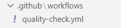
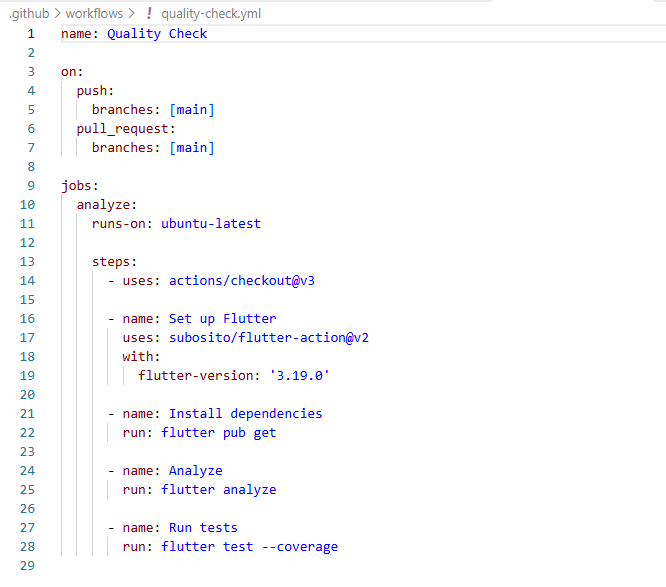
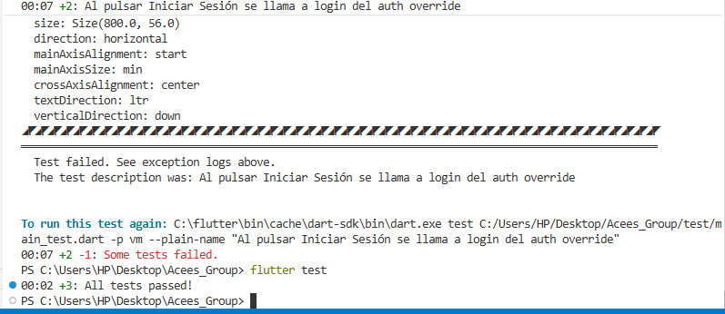

# 📱 Acees Group — Sistema de Control de Acceso NFC

Sistema de control de accesos con tecnología NFC desarrollado en Flutter con arquitectura MVVM.

---

## Índice
- [Datos del proyecto](#datos-del-proyecto)  
- [Evidencias](#evidencias)  
- [Explicación de lo realizado](#explicación-de-lo-realizado)  
- [Cómo probar localmente](#cómo-probar-localmente)  
- [Workflow de GitHub Actions](#workflow-de-github-actions)  
- [Entrega / Conversión a PDF](#entrega--conversión-a-pdf)  
- [Consideraciones finales](#consideraciones-finales)

---

## Datos del proyecto
- Curso: Soluciones Móviles II  
- Fecha: 18/11/2025  
- Presentado por: Juan Brendon Luna Juarez  
- Repositorio: https://github.com/LunaJuarezJuan/SM2_ExamenUnidad3.git

---

## Evidencias
Incluye capturas en la carpeta `imgs/` (ya referenciadas abajo). Sustituye los placeholders por imágenes reales antes de generar el PDF.

- Estructura de carpetas `.github/workflows/`  
  

- Contenido del archivo `quality-check.yml`  
  

- Ejecución de `flutter test` (previa subida o local)  
  

- Ejecución del workflow en la pestaña Actions  
  

---

## Explicación de lo realizado
Se implementaron los siguientes cambios y añadidos para cumplir con los requisitos del examen:

- Workflow GitHub Actions:
  - Archivo: `.github/workflows/quality-check.yml`
  - Acciones: instalación de Flutter, `flutter pub get`, `flutter analyze` y `flutter test`.
  - Se ejecuta en eventos `push` y `pull_request` sobre la rama `main`.

- Tests:
  - Carpeta `test/` con `test/main_test.dart` que contiene pruebas widget/ unitarias (mínimo 3).
  - Se usan pruebas que no dependen de servicios reales inyectando un `authOverride` en `LoginView`.

- Código:
  - `lib/views/login_view.dart` modificado para permitir inyección de dependencias en tests mediante `authOverride`. En modo test se evita navegar a pantallas que requieren Providers presentes solo en la app real.

---

## Cómo probar localmente
Desde la raíz del proyecto:

1. Instalar dependencias:
   ```
   flutter pub get
   ```

2. Analizar el proyecto:
   ```
   flutter analyze
   ```

3. Ejecutar tests:
   ```
   flutter test
   ```
   - Ejecutar un archivo específico:
     ```
     flutter test test/main_test.dart
     ```
   - Ejecutar un test por nombre:
     ```
     flutter test --name "parte del nombre del test"
     ```

Notas:
- Los widget tests se ejecutan sin emulador.
- Si aparece algún error por imports, ajusta la ruta del paquete en los tests según `pubspec.yaml`.

---

## Workflow de GitHub Actions
El flujo se encuentra en `.github/workflows/quality-check.yml`. Debe ejecutar automáticamente  `flutter test` en cada push o PR a `main`.


---


